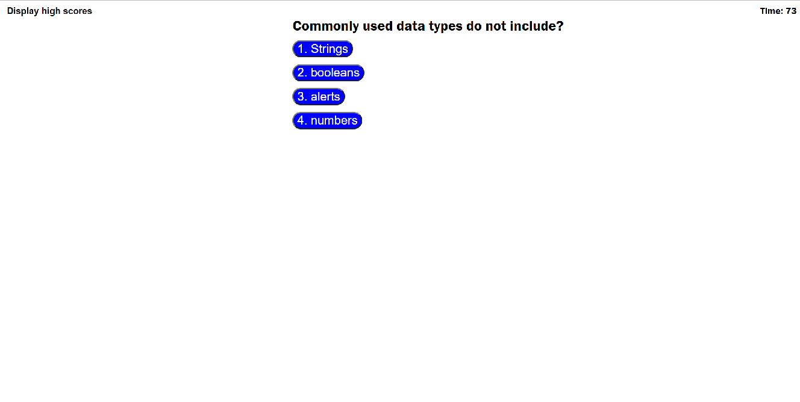

# quiz

JavaScript coding quiz. Prompts the user a series of questions with potential answers and gives them a score based on how well they did.

## Technologies used

JavaScript, HTML, and CSS.

## Deployment

This project is deployed at: https://webgeekbear.github.io/quiz/

## Snapshot

